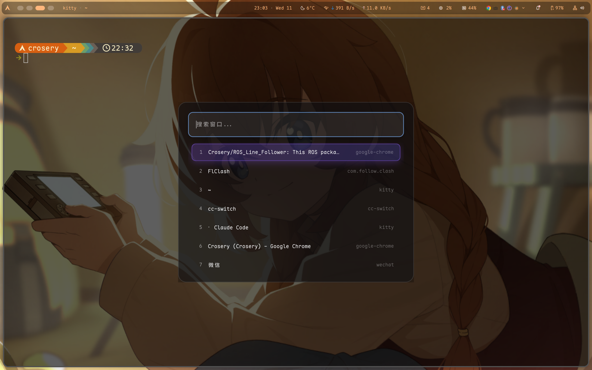

# Niri Window Switcher

**English** | **[中文](README_ZH.md)**

A modern window switcher for Niri Wayland compositor built with GTK4 and Layer Shell.



## Features

- Fuzzy search with smart ranking
- Full keyboard navigation
- Glassmorphism UI design
- Customizable via config files
- Fast and lightweight

## Installation

One-line install (no dependencies required, Alt+Tab ready out of the box):

```bash
curl -fsSL https://raw.githubusercontent.com/Crosery/niri-window-switcher/main/install.sh | bash
```

Supported distros: Arch / Manjaro / EndeavourOS / CachyOS / Debian / Ubuntu / Mint / Pop!_OS / Fedora / Nobara / openSUSE

Uninstall:

```bash
curl -fsSL https://raw.githubusercontent.com/Crosery/niri-window-switcher/main/install.sh | bash -s -- --uninstall
```

### Manual Build

```bash
cargo build --release
cp target/release/niri-switcher ~/.local/bin/niri-window-switcher
```

For manual install, add keybinding to `~/.config/niri/binds.kdl`:

```kdl
binds {
    Alt+Tab repeat=false { spawn "niri-window-switcher"; }
}
```

## Configuration

### Window Size (Optional)

Create `~/.config/niri-window-switcher/config.toml`:

```toml
[window]
width = 680
height = 520
```

### Custom Styling (Optional)

Copy and customize the default style:

```bash
mkdir -p ~/.config/niri-window-switcher
cp style.css ~/.config/niri-window-switcher/style.css
# Edit ~/.config/niri-window-switcher/style.css
```

The CSS file uses standard GTK4 CSS syntax. Key selectors:

- `window` - Main window background and border
- `entry` - Search input box
- `row` - Window list items
- `row:selected` - Selected item
- `label` - Text styling

## Keyboard Shortcuts

- Type to search
- `↑`/`↓` or `Ctrl+P`/`Ctrl+N` to navigate
- `Enter` to select
- `1-9` for quick select
- `Esc` to cancel

## License

MIT
